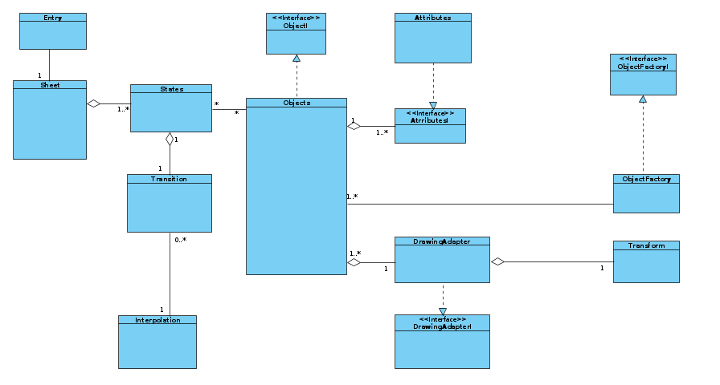
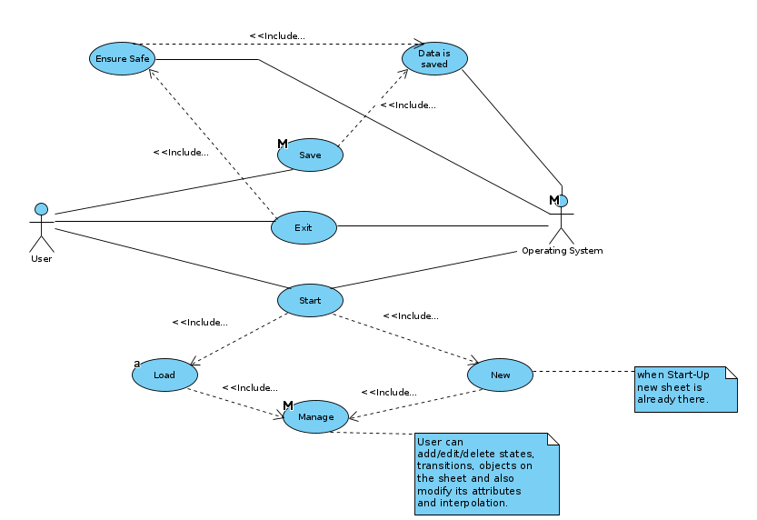
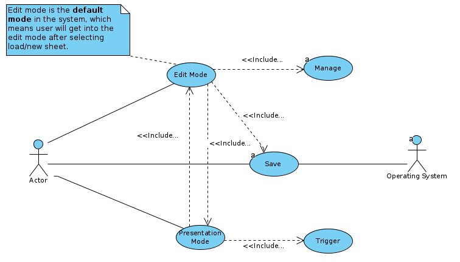
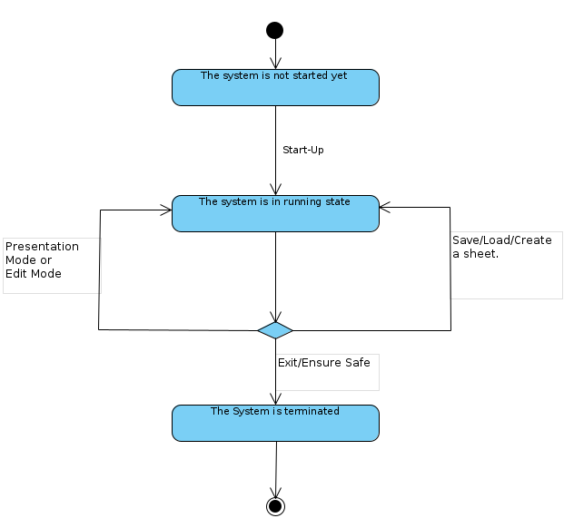
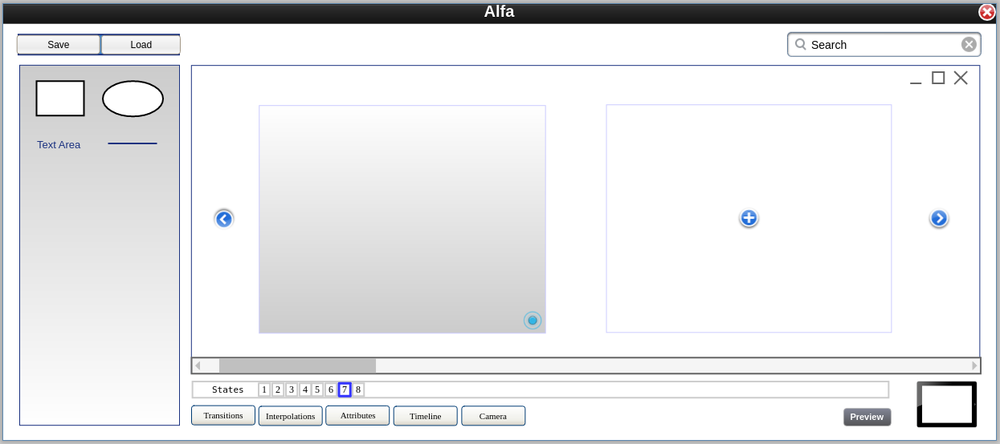
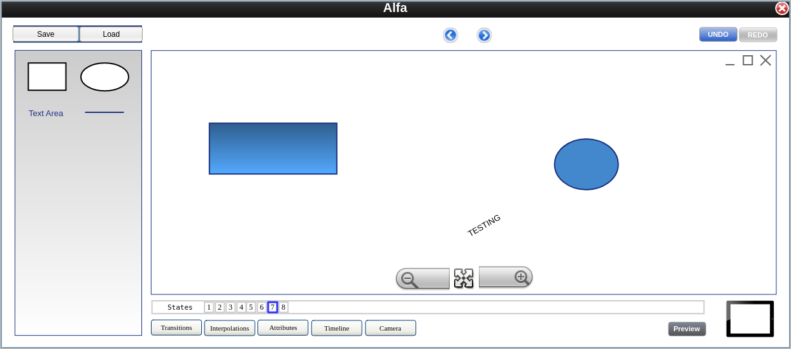
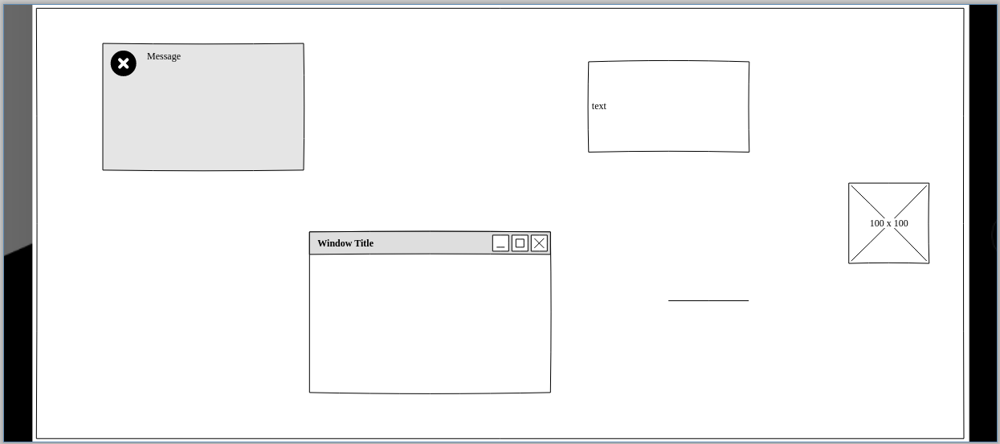
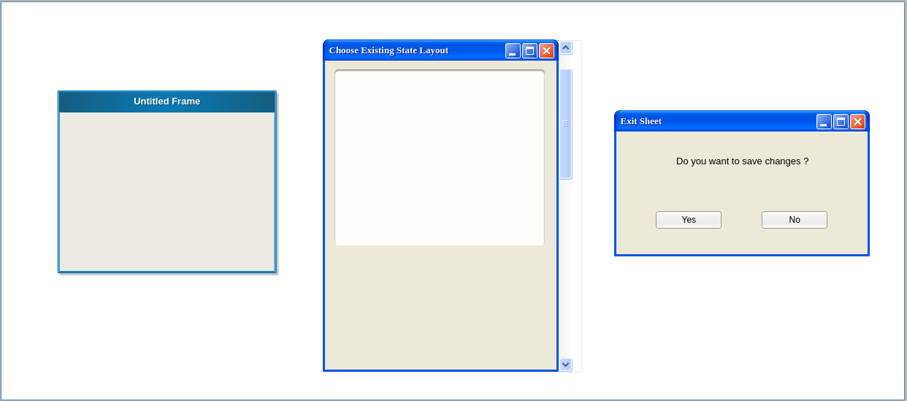

# **Prezoom Software Requirements Specification**

## Team Alfa Members
    1. Disha Bodiwala
    2. Kwame Owusu-Boakye
    3. Jagbir Singh Aulakh
    4. Shiv Umeshbhai Tilva
    5. Vraj Sanjaykumar Patel

## Domain model:



<!-- ```mermaid
classDiagram
    Sheet "1" o-- "0..*" States
    States "1" o-- "0..*" Objects
    Objects "1" o-- "0..*" Attributes
    Camera "1" o-- "0..*" Attributes
    Transitions "1" -- "2" States
    Transitions -- Timeline
    Timeline --* Mode
    Transitions *-- Camera
    Interpolations -- Objects

    Transitions : trigger()
    Mode : edit()
    Mode : presentation()
``` -->

## Lexicon
### [1]	State:
A state is a combination of 0 or more objects. Multiple states are present on a single sheet and change according to transitions. 

### [2]	Objects:
Objects can have 1 or more attributes and can belong to multiple states using a link id.

### [4]	Attributes:
It describes a set of possible features related to an objects or the camera.

### [5]	Transitions:
Transitions provide a transformation from one state to another through a triggering mechanism. This causes the camera to move to the next state accordingly.

### [6]	Interpolation:
Interpolation provides information about transition of objects. The same interpolation method can be applied to multiple objects.

### [7]	Camera:
It has 1 or more attributes and focuses on current state.

### [8]	Timeline:
A timeline describes the sequence (flow) of transitions which can be presented or edited according to modes.

### [9]	Mode:
Each sheet consists of two mode types (Edit and Presentation) where edit mode is the default one in which user can define and manipulate various states, transitions, objects, and interpolation. The presentation mode presents the timeline.

### [10] Sheet:
User can create a new sheet or load an existing sheet. After editing a sheet, user can save it for later use. Each sheet can contain multiple states.

### [11] Trigger:
This describes the occurrence of an event in relation to a transition.


## User Stories
    1. Sheets
        1.1. As a user, I should be able to create a new SHEET.
        1.2. As a user, I should be able to load a previously saved sheet.
        1.3. As a user, I should be able to save a sheet.
        1.4. As a user, I should be able to specify the start state.
        1.5. As a user, I should be able to exit the sheet.

    2. States
        2.1. As a user, I should be able to add a state to a sheet.
        2.2. As a user, I should be able to delete a state.
        2.3. As a user, I should be able to reorder states.
        2.4. As a user, I should be able to view the presentation at any state.

    3. Objects
        3.1. As a user, I should be able to add different type of objects.
        3.2. As a user, I should be able to delete an object.
        3.3. As a user, I should be able to edit an object (by changing value of attributes).
    
    4. Transition
        4.1. As a user, I should be able to add a transition.
        4.2. As a user, I should be able to delete a transition.
        4.3. As a user, I should be able to edit a transition.
    
    5. Interpolation
        5.1. As a user, I should be able to adjust an object’s mode of transition.
    
    6. Mode
        6.1. As a user, I should be able to switch two modes (Edit or Presentation).


## Use Cases

### Use Case 1: Overview
**Subject**: The Prezoom System  
**Actors involved**: User, The operating System  
**Requirements addressed**: 1.\*, 2.\*, 3.\*, 4.\*, 5.\*  
**Precondition**: The system is not started yet

#### Typical flow:

1. User request Operating System to start the Alfa Project
2. Operating System prompts user to create new or sheet are use an existing sheeet
3. if the user selects "Create new"  
    <ol type="a">
        <li> The system creates a new blank sheet. </li>
        <li> User can add/edit/delete objects, states, transitions either by drag and drop or clicking a corresponding button. </li> 
        <li> User can save sheet by clicking the save button. </li>  
        <li> User can alternatively exit the system using the toolbar. </li>
    </ol>
4. Else if the user chooses "Load an existing sheet"  
    <ol type="a">
        <li> The operating System prompts the user to load an existing sheet. </li>
        <li> The User selects a saved sheet which is loaded into the system. </li>
        <li> User can add/edit/delete objects, states, transitions either by drag and drop or clicking a corresponding button. </li> 
        <li> User can save sheet by clicking the save button. </li>  
        <li> User can again exit the system using the toolbar. </li>
    </ol>

#### Alternative flow:
- If the user selects cancel in the file picker (in step 4.a),
the process starts again at step 2.  

**Postcondition**: The system is in running state.


### Use Case 2: Switching between modes
**Subject**: The Prezoom System  
**Actors involved**: User, The operating System  
**Requirements addressed**: 6.\*  
**Precondition**: The system is in running state.

#### Typical flow:
1. When in edit mode, User can click "Present" to switch directly to presentation mode.
2. When in presentation mode, user can press "ESC" to switch to edit mode.

**Postcondition**: The system is in running state.


### Use Case 3: Exit
**Subject**: The Prezoom System  
**Actors involved**: User, The operating System  
**Requirements addressed**: 1.5  
**Precondition**: The system is in running state.

#### Typical flow:
1. The user selects the exit from toolbar, or by using the OS to send a “close” message to the main window.
2. Include “ensure the data is safe”
3. The system requests the Operating System to terminate its process.

**Postcondition**: The system is terminated  
**Alternative paths**: If the user selects cancel in step 2 the use case stops with postcondition “The system is started”. 

## Use Case Diagrams

### Case 1 : Overview


### Case 2: Switching between modes 



## State Diagram

### Preconditions and postconditions as states 




## Wireframe

### Edit Mode [All States]


### Edit Mode [Single State]


### Presentation Mode


### Widgets

 

## Deliverables

### Iteration 0:
- Domain Model.
- Lexicon.
- User Stories.
- Use Case.
- Use Case diagram and State diagram.
- Wireframe.
    
### Iteration 1:
- Template UI
- Transitions between states
- Adding object in the state
- Defining various attributes for each object.
- Changing attribute values.
    
### Iteration 2:
- Presentation mode.
- Save/Load file.
- Camera.
- Switching the modes between edit and presentation mode.
- Interpolation.